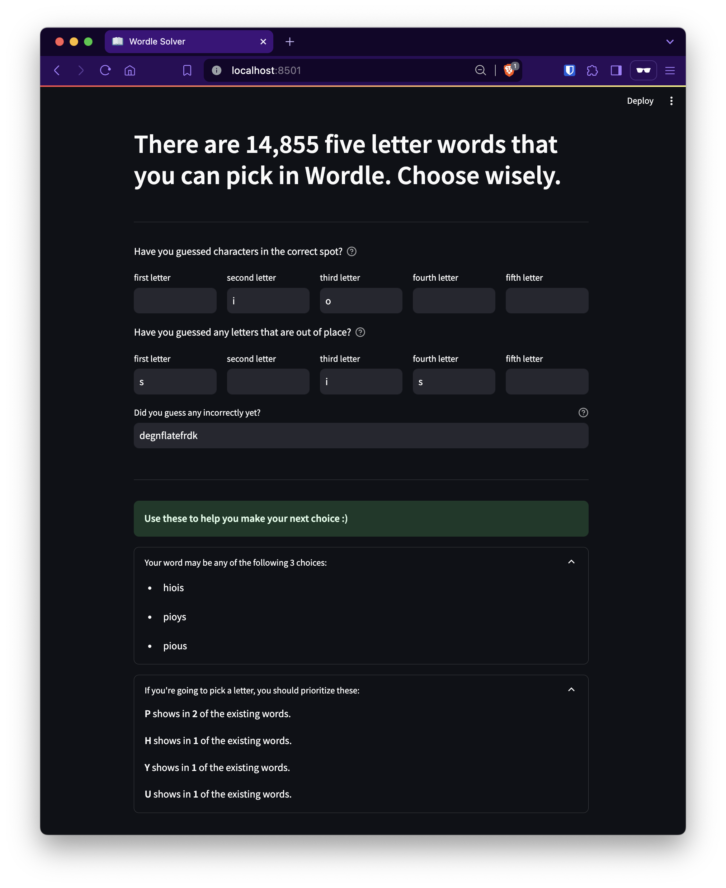

# Wordle Solver

This app helps to solve the daily puzzles on **[Worlde](https://www.powerlanguage.co.uk/wordle/)**. It takes all 5 letter english words into consideration, slims them down based on your (in)correct guesses, and outputs a list of all still existing words.

Add letters to the boxes as you guess, and see the words populate below. The 'incorrect' and 'out of place' boxes can hold multiple characters, which should be input with no spaces `'rofl'`

**[Check out the app on Streamlit!](https://wordle.watermancorley.com/)**

